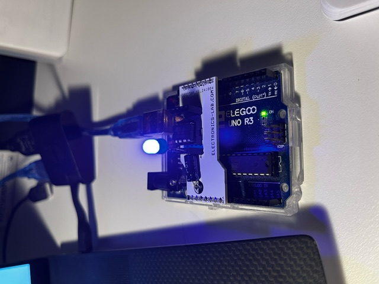

# Lego LED project

## Used boards 

### attiny85 board

&nbsp;&nbsp;&nbsp;&nbsp;&nbsp;

#### type of flash
Arduino ISP by using a PCB board for wiring from Arduino UNO : 

https://www.electronics-lab.com/project/attiny85-8-pin-arduino-programing-shield/

#### Arduino ISP setup for platformIO
https://docs.platformio.org/en/latest/platforms/atmelavr.html 

#### avrdude fuse bit setup

https://www.engbedded.com/fusecalc/
