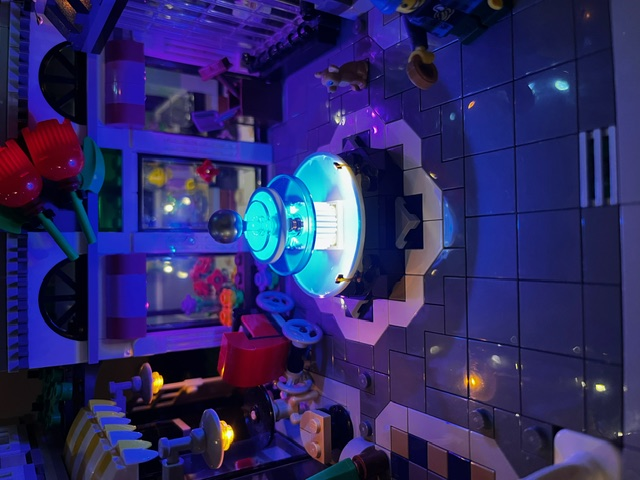
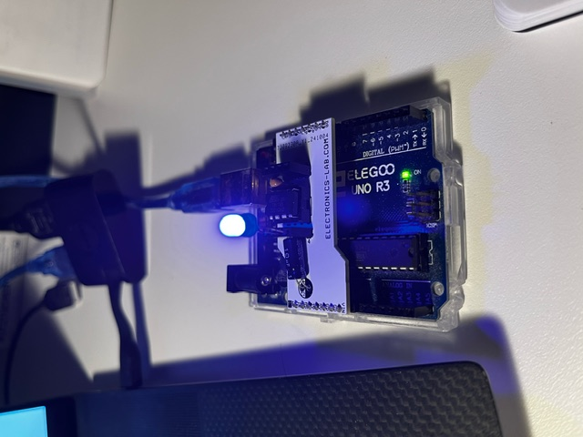

# Lego LED

LEGO models lit by wireless power transfer. A transmitter coil under the model runs at
142 kHz, a receiving coil inside picks the power up, and the board on top drives LEDs,
an OLED, or a colour LCD playing video — no battery in the model and no wire into it.

## Builds

| Build | MCU | Drives | Notes |
|---|---|---|---|
| [`fountain/`](fountain/) | ATtiny85 | Fountain LEDs | [README](fountain/README.md) |
| [`attiny85_oled/`](attiny85_oled/) | ATtiny85 | SSD1306 OLED animation inside 8k flash | [README](attiny85_oled/README.md) |
| [`stm32/l412/`](stm32/l412/) | STM32L412 | MJPEG video on a 96×54 ST7735 | [POWER_ANALYSIS.md](stm32/l412/POWER_ANALYSIS.md) |
| [`stm32/f411_disco/`](stm32/f411_disco/) | STM32F411 Discovery | JPEG decoded out of flash | |
| [`stm32/u375/`](stm32/u375/) | STM32U375 | Custom PCB — external flash, colour LCD, touch | [DESIGN_NOTES.md](stm32/u375/DESIGN_NOTES.md) · [INDUCTOR_CALC.md](stm32/u375/INDUCTOR_CALC.md) |

## Branches

One branch per board. They are not meant to converge — each carries the firmware for a
different MCU driving the same kind of display.

| Branch | Directory | Board |
|---|---|---|
| `master` | | trunk — fountain, ATtiny85 OLED, STM32 |
| `attiny85-duck` | `attiny85_oled/` | ATtiny85, Arduino framework |
| `attiny85-duck-bare-metal` | `attiny85_oled/` | ATtiny85 without the Arduino framework |
| `stc8g-duck` | `attiny85_oled/` | STC8G |
| `msp430` | `msp430_st7735/` | MSP430FR2433 + ST7735 |
| `st7789` | `st7789_lcd/` | ST7789 LCD |
| `stm32-f411` | `stm32/f411_disco/` | merged into `master` |

## Design notes

Written in Korean.

- [STM32U375 board design](stm32/u375/DESIGN_NOTES.md) — the parts chosen for the custom
  PCB and why: MCU with a built-in SMPS, buck-boost rail, external flash, 0.42" colour LCD
- [Inductor sizing](stm32/u375/INDUCTOR_CALC.md) — ripple and peak current for a switching
  converter, and the saturation rating that follows from them
- [STM32L412 power analysis](stm32/l412/POWER_ANALYSIS.md) — measured draw during video
  playback across clock and voltage ranges, and why an unstable supply invalidates a reading

## Flashing the ATtiny85

&nbsp;&nbsp;&nbsp;&nbsp;&nbsp;

#### type of flash
Arduino ISP by using a PCB board for wiring from Arduino UNO : 

https://www.electronics-lab.com/project/attiny85-8-pin-arduino-programing-shield/

#### Arduino ISP setup for platformIO
https://docs.platformio.org/en/latest/platforms/atmelavr.html 

#### avrdude fuse bit setup

https://www.engbedded.com/fusecalc/

## Choosing Inductor
Receiving coil is the most important part for WPT. It must be always resonance circuit for the best effectiveness of WPT.
Fequency of transmission coil is 142kHz, therefore, there are a lot of combination depending on the inductance and capacitance.

These are all combinations between the inductance 100uH ~ 1.5mH from the website lcsc.com.

With resonance, another important factor is DCR in inductor. 
Normally, if the inductance is higher, the resistance in the inductor (DCR) is higher.

Therefore, the first image shows the relation between the factor and its inductance.
Bubble size is the size of inductor, which is the standard size as it's shown -

Four inductors (470uH, 680uH, 820uH, 1500uH) are chosen according to the highest factor values.
