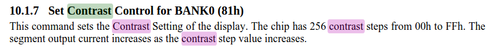

# WPT OLED in ATtiny85 board

OLED display supplied by Wireless Power Transfer (WPT)

### Choosing Inductor
Receiving coil is the most important part for WPT. It must be always resonance circuit for the best effectiveness of WPT.
Fequency of transmission coil is 142kHz, therefore, there are a lot of combination depending on the inductance and capacitance.

These are all combinations between the inductance 100uH ~ 1.5mH from the website lcsc.com.

With resonance, another important factor is DCR in inductor. 
Normally, if the inductance is higher, the resistance in the inductor (DCR) is higher.

Therefore, the first image shows the relation between the factor and its inductance.
Bubble size is the size of inductor, which is the standard size as it's shown -

Four inductors (470uH, 680uH, 820uH, 1500uH) are chosen according to the highest factor values.
