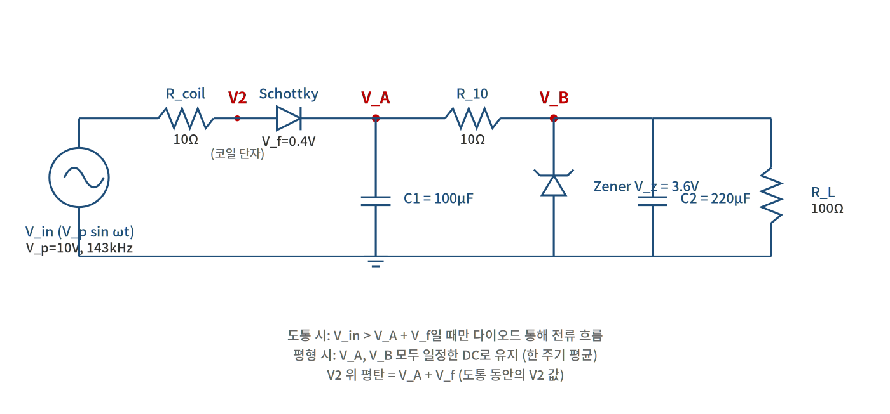

# WPT 수신 회로 정상상태 평형 분석

> Schottky 정류 + 평활 캡 + Zener 클램프 회로의 위쪽 클리핑 메커니즘

---

## 1. 회로 구조



### 부품 및 노드 정의

| 기호 | 의미 | 예시 값 (이번 분석) |
|---|---|---|
| $V_{in}(t)$ | 코일 유도 사인파 출력 | $V_p = 10\text{V peak}$, $f = 143\text{kHz}$ |
| $R_{coil}$ | 코일 직렬 등가 저항 (DC 저항 + 손실) | $10\,\Omega$ |
| $V_f$ | Schottky 다이오드 순방향 강하 | $0.4\text{V}$ |
| $R_{10}$ | 다이오드와 부하 사이 직렬 저항 (Zener 보호용) | $10\,\Omega$ |
| $V_z$ | Zener 항복 전압 | $3.6\text{V}$ |
| $R_L$ | 부하 저항 (LCD + MCU 등가) | $100\,\Omega$ |
| $C_1$ | 1차 평활 캡 ($V_A$ 노드) | $100\,\mu\text{F}$ |
| $C_2$ | 2차 디커플링 캡 ($V_B$ 노드) | $220\,\mu\text{F}$ |
| $V_2$ | 코일 직후, 다이오드 직전 노드 전압 | 측정점 |
| $V_A$ | 다이오드 후, 평활 캡 양단 전압 (1차) | 평형 시 일정 |
| $V_B$ | $R_{10}$ 후, Zener/부하 노드 전압 (2차) | 평형 시 일정 |

---

## 2. 핵심 가정

이 분석은 다음 세 가지 가정 위에서 성립한다:

- **캡 평형 (DC 근사):** 정상 상태에서 $V_A$, $V_B$는 한 주기 평균으로 변화 없음. 캡 양단 전압을 일정한 DC로 근사. 큰 캡일수록 정확.
- **다이오드 이상화:** $V_{in} > V_A + V_f$일 때만 도통, 도통 시 $V_f$ 만큼 강하 후 통과. 비도통 시 완전 차단.
- **Zener 이상화:** 도통 시 $V_B = V_z$ 정확히 유지 ($r_z = 0$). $V_B < V_z$ 시 완전 차단.

---

## 3. 다이오드 도통 조건

입력 전압:

$$V_{in}(t) = V_p \sin(\omega t)$$

다이오드는 다음 조건일 때만 도통:

$$V_{in}(t) > V_A + V_f$$

도통 시작 각:

$$\theta_1 = \arcsin\!\left(\frac{V_A + V_f}{V_p}\right)$$

도통 종료 각: $\theta_2 = \pi - \theta_1$ (사인파 대칭).

한 주기 중 도통 시간 비율:

$$\frac{t_{on}}{T} = \frac{\pi - 2\theta_1}{2\pi}$$

---

## 4. 평균 다이오드 전류

도통 동안 다이오드 전류 (캡 $V_A$ 일정 가정):

$$I_{diode}(t) = \frac{V_p \sin(\omega t) - V_f - V_A}{R_{coil}}$$

### 4.1 평균의 정의

$\overline{I}_{diode}$는 **한 주기 평균 전류**:

$$\overline{I}_{diode} = \frac{1}{T} \int_0^T I_{diode}(t) \, dt$$

> **왜 $1/T$가 있나:** 평균이라서. 적분은 "누적량"이고 그걸 시간 $T$로 나눠야 평균이 된다.
> 비유: 하루 7시간 잤으면 평균 수면시간 = $7\text{h} / 1\text{day}$. **$1/T$가 평균을 만드는 핵심.**

비도통 동안 $I_{diode} = 0$이라 적분 구간을 도통 구간 ($t_1, t_2$)으로 좁혀도 결과 같음:

$$\overline{I}_{diode} = \frac{1}{T} \int_{t_1}^{t_2} \frac{V_p \sin(\omega t) - V_f - V_A}{R_{coil}} \, dt$$

### 4.2 변수 치환 $\theta = \omega t$

시간 변수 $t$ 대신 위상 각도 $\theta$로 바꾸면 식이 깔끔해짐.

**미분 관계** (연쇄법칙):

$$\theta = \omega t \implies d\theta = \omega \, dt \implies dt = \frac{d\theta}{\omega}$$

**적분 한계 변환:**

| 시간 변수 $t$ | 각도 변수 $\theta$ |
|---|---|
| $t_1$ (도통 시작) | $\omega t_1 = \theta_1$ |
| $t_2$ (도통 끝) | $\omega t_2 = \pi - \theta_1$ |

치환 적용:

$$\overline{I}_{diode} = \frac{1}{T} \int_{\theta_1}^{\pi - \theta_1} \frac{V_p \sin\theta - V_f - V_A}{R_{coil}} \cdot \frac{d\theta}{\omega}$$

> **이 식에 $\omega$와 $1/T$가 둘 다 있는 이유 (출처가 다름):**
> - **$1/T$**: 원래 평균 정의에서 온 것 (적분 밖, 안 건드림)
> - **$1/\omega$**: 변수 치환 $dt \to d\theta/\omega$에서 온 것 (적분 안)
>
> 그냥 빼면 안 됨:
> - $1/T$ 빼면 평균이 아니라 그냥 적분(누적량). 단위도 안 맞음 ($\int I \, dt$ = 쿨롱).
> - $1/\omega$ 빼면 치환이 틀림 ($dt$ → $d\theta$ 비율 무시).

### 4.3 $T$를 $\omega$로 표현해서 상쇄

주기와 각속도 관계:

$$\omega = \frac{2\pi}{T} \quad \Leftrightarrow \quad T = \frac{2\pi}{\omega} \quad \Leftrightarrow \quad \frac{1}{T} = \frac{\omega}{2\pi}$$

> **왜 그런가:** 한 주기 = $2\pi$ 라디안, 한 주기 동안 시간 = $T$. 각속도 = 각도/시간 = $2\pi/T$.
>
> **143kHz 검증:** $T = 1/143000 \approx 7\,\mu s$, $\omega = 2\pi \times 143000 \approx 898{,}000$ rad/s, $2\pi/T = 898{,}000$ rad/s ✓

대입:

$$\overline{I}_{diode} = \frac{\omega}{2\pi} \int_{\theta_1}^{\pi - \theta_1} \frac{V_p \sin\theta - V_f - V_A}{R_{coil}} \cdot \frac{d\theta}{\omega}$$

분자(앞)와 분모(뒤)의 $\omega$ 상쇄:

$$\overline{I}_{diode} = \frac{1}{2\pi R_{coil}} \int_{\theta_1}^{\pi - \theta_1} \!\left[V_p \sin\theta - (V_f + V_A)\right] d\theta$$

### 4.4 식 요소별 출처 정리

| 식 요소 | 어디서 왔나 |
|---|---|
| $1/T$ | 평균 정의 (한 주기 평균을 만드는 normalization factor) |
| $1/\omega$ (적분 안) | 변수 치환 $dt = d\theta/\omega$ |
| 최종 $1/2\pi$ | $1/T = \omega/2\pi$ 변환 후 $\omega$ 상쇄 결과 |

**핵심:** $\omega$, $T$ 모두 사라진 건 결과적으로 평형 $V_A$가 **주파수에 무관**하다는 의미. 143kHz든 100kHz든 같은 평형 $V_A$.

### 4.5 적분 수행

$$\int_{\theta_1}^{\pi - \theta_1} V_p \sin\theta \, d\theta = 2 V_p \cos\theta_1$$

$$\int_{\theta_1}^{\pi - \theta_1} (V_f + V_A) \, d\theta = (V_f + V_A)(\pi - 2\theta_1)$$

### 결과

$$\boxed{\;\overline{I}_{diode} = \frac{2 V_p \cos\theta_1 - (V_f + V_A)(\pi - 2\theta_1)}{2\pi R_{coil}}\;}$$

---

## 5. 평형 조건

캡 $C_1$이 평형 (한 주기 평균 충전 = 방전)이면 평균 다이오드 전류는 모두 $R_{10}$을 통해 $V_B$ 노드로 흐른다:

$$\overline{I}_{diode} = I_{R_{10}} = \frac{V_A - V_B}{R_{10}}$$

---

## 6. Zener 동작 분기

### Case 1: Zener 도통 ($V_B = V_z$)

$V_B$가 $V_z$에 묶임. $R_{10}$ 통과 전류:

$$I_{R_{10}} = \frac{V_A - V_z}{R_{10}}$$

**평형 방정식 (Case 1):**

$$\boxed{\;\frac{2 V_p \cos\theta_1 - (V_f + V_A)(\pi - 2\theta_1)}{2\pi R_{coil}} = \frac{V_A - V_z}{R_{10}}\;}$$

**유효 조건** (Zener 전류 양수):

$$I_{zener} = \frac{V_A - V_z}{R_{10}} - \frac{V_z}{R_L} > 0$$

### Case 2: Zener 비도통 ($V_B < V_z$)

Zener 동작 안 하면 $V_B$는 단순 $R_{10}$–$R_L$ 분배:

$$V_B = V_A \cdot \frac{R_L}{R_{10} + R_L}$$

$$I_{R_{10}} = \frac{V_A}{R_{10} + R_L}$$

**평형 방정식 (Case 2):**

$$\boxed{\;\frac{2 V_p \cos\theta_1 - (V_f + V_A)(\pi - 2\theta_1)}{2\pi R_{coil}} = \frac{V_A}{R_{10} + R_L}\;}$$

**유효 조건**: $V_B < V_z$

### 풀이 절차

1. Case 1 (Zener 도통)을 먼저 가정하고 $V_A$ 수치 풀이 (Newton-Raphson, brentq 등)
2. $I_{zener} > 0$ 검증. 통과하면 해 유효.
3. 실패하면 Case 2 (Zener 비도통)으로 다시 풀이. $V_B < V_z$ 검증.

> **주의:** $\theta_1$이 $V_A$의 함수라 양변 모두 $V_A$에 비선형. 분석적 닫힌 해 없음. 수치 해법 필수.

---

## 7. $V_2$ (코일 단자) 위쪽 평탄 V

$V_2$ = 코일 직후, 다이오드 직전 노드. 도통 시:

$$V_2(t) = V_{in}(t) - I_{diode}(t) \cdot R_{coil}$$

도통 동안 $I_{diode}(t) = (V_{in}(t) - V_f - V_A) / R_{coil}$ 대입하면 $V_{in}(t)$와 $R_{coil}$ 항이 상쇄:

$$\boxed{\;V_2 \text{ (도통 시)} = V_A + V_f\;}$$

**핵심:** 도통 동안 $V_2$는 $V_A + V_f$로 평탄 ($R_{coil}$ 무관). $R_{coil}$은 $V_A$ 결정에 영향 미쳐 간접적으로 $V_2$ 평탄 V 조절. 이게 '위쪽 클리핑'의 정확한 메커니즘.

비도통 동안 $V_2(t) = V_{in}(t)$ (사인파 그대로). 음의 반주기는 그대로 따라감.

---

## 8. 수치 검증 (PSIM 시뮬레이션과 일치)

$V_p = 10\text{V}$, $V_f = 0.4\text{V}$, $V_z = 3.6\text{V}$ 고정. 저항 조합 변화시킨 결과:

| $R_{coil}$ | $R_{10}$ | $R_L$ | $V_A$ | $V_2$ 위 평탄 | Zener | 도통 비율 |
|---|---|---|---|---|---|---|
| $10\,\Omega$ | $10\,\Omega$ | $100\,\Omega$ | 4.60V | **5.00V** | 도통 | 26% |
| $2\,\Omega$ | $10\,\Omega$ | $100\,\Omega$ | 6.38V | **6.78V** | 도통 | 26% |
| $10\,\Omega$ | $2\,\Omega$ | $100\,\Omega$ | 3.87V | **4.27V** | 도통 | 30% |
| $10\,\Omega$ | $10\,\Omega$ | $20\,\Omega$ | 3.95V | **4.35V** | 비도통 | 36% |

---

## 9. 다이오드 / Zener 전류 분석

평형 $V_A$가 결정되면, 식들로 다이오드와 Zener에 흐르는 전류 다 계산 가능.

### 9.1 다이오드 전류 (3종)

**순시 전류** (도통 동안 매 순간):

$$I_{diode}(t) = \frac{V_p \sin(\omega t) - V_f - V_A}{R_{coil}}$$

**피크 전류** ($\sin(\omega t) = 1$일 때 = $V_{in}$ 최대):

$$I_{diode,peak} = \frac{V_p - V_f - V_A}{R_{coil}}$$

> 다이오드 데이터시트 $I_{FSM}$ (peak surge current)와 비교해야 할 값

**평균 전류** (위에서 유도한 식):

$$\overline{I}_{diode} = \frac{2 V_p \cos\theta_1 - (V_f + V_A)(\pi - 2\theta_1)}{2\pi R_{coil}}$$

> 다이오드 $I_{F(av)}$ (average forward current)와 비교

**RMS 전류** (발열 계산용):

$$I_{RMS} = \sqrt{\frac{1}{2\pi} \int_{\theta_1}^{\pi - \theta_1} \!\left[\frac{V_p \sin\theta - V_f - V_A}{R_{coil}}\right]^2 d\theta}$$

> $R_{coil}$ 발열: $P_{R_{coil}} = I_{RMS}^2 \times R_{coil}$

### 9.2 부하 / Zener 전류

평형 시 $R_{10}$ 통과 전류 = 평균 다이오드 전류:

$$I_{R_{10}} = \overline{I}_{diode} = \frac{V_A - V_B}{R_{10}}$$

$V_B$ 노드에서 분기:

$$I_{R_{10}} = I_{load} + I_{zener}$$

**Case 1 (Zener 도통, $V_B = V_z$):**

$$I_{load} = \frac{V_z}{R_L}, \quad I_{zener} = I_{R_{10}} - I_{load}$$

**Case 2 (Zener 비도통):**

$$I_{load} = \frac{V_B}{R_L} = \frac{V_A}{R_{10} + R_L}, \quad I_{zener} = 0$$

**Zener 발열:**

$$P_{zener} = I_{zener} \times V_z$$

> SOD-523 Zener 보통 정격 200~500mW. 이 한도 넘으면 태움.

### 9.3 종합 수치 표

| $R_c$ | $R_{10}$ | $R_L$ | $V_A$ | $I_{peak}$ | $\overline{I}_{diode}$ | $I_{RMS}$ | $P_{R_c}$ | $I_{load}$ | $I_{zener}$ | $P_{zener}$ | Zener |
|---|---|---|---|---|---|---|---|---|---|---|---|
| 10Ω | 10Ω | 100Ω | 4.67V | 493mA | 107mA | 204mA | 418mW | 36mA | 71mA | 256mW | 도통 |
| 2Ω | 10Ω | 100Ω | 6.38V | **1608mA** | 278mA | 597mA | 713mW | 36mA | 242mA | **871mW ⚠️** | 도통 |
| 10Ω | 2Ω | 100Ω | 3.87V | 573mA | 134mA | 247mA | 610mW | 36mA | 98mA | 353mW | 도통 |
| 10Ω | 10Ω | 20Ω | 3.95V | 565mA | 132mA | 243mA | 590mW | 132mA | 0mA | 0mW | 비도통 |
| **10Ω** | **20Ω** | **100Ω** | **5.32V** | **428mA** | **86mA** | **171mA** | **292mW** | **36mA** | **50mA** | **180mW** | **도통** |
| **20Ω** | **10Ω** | **100Ω** | **4.21V** | **269mA** | **61mA** | **114mA** | **261mW** | **36mA** | **25mA** | **90mW** | **도통** |

### 9.4 핵심 관찰

#### (1) $R_{coil}$ vs $R_{10}$ 트레이드오프

둘 다 합 30Ω일 때 비교:

| 항목 | $R_c$=10, $R_{10}$=20 | $R_c$=20, $R_{10}$=10 |
|---|---|---|
| $V_A$ | **5.32V** ✓ | 4.21V |
| $I_{peak}$ | 428mA | **269mA** ✓ |
| $P_{R_c}$ | 292mW | 261mW |
| $I_{zener}$ | 50mA | **25mA** ✓ |

- $R_{10}$ 키우는 게 **$V_A$ 높이는 데 유리** (V_A = V_z + I × R_10)
- $R_{coil}$ 키우는 게 **다이오드 / Zener 부담 줄임** (전류 흐름 제한)

#### (2) $R_{coil}$ 너무 작으면 위험

$R_c = 2\Omega$ 케이스:
- $V_A$ 6.38V (좋음)
- 하지만 **피크 전류 1.6A**, **Zener 발열 871mW** (정격 초과!)

작은 $R_{coil}$이 V는 좋게 만들지만 전류 스파이크 때문에 다이오드/Zener 정격 초과 위험. 균형점이 중요.

#### (3) $R_{10}$의 역할 명확

$R_{10}$이 정확히 **Zener 보호 저항**으로 작동:
- $R_{10}$ 작을수록 Zener 전류 큼
- $R_{10}$ 클수록 Zener 전류 작음
- 너무 크면 V_A 너무 높아져 다이오드 정격 위험

권장: $R_{10}$ = 10~20Ω 범위.

---

## 10. 전력 효율 분석

### 10.1 전력 손실 분해

회로의 모든 전력 흐름:

$$P_{total} = P_{load} + P_{R_{coil}} + P_{R_{10}} + P_{zener} + P_{diode}$$

각 항:

| 항목 | 식 | 의미 |
|---|---|---|
| $P_{load}$ | $V_B \times I_{load}$ | 부하가 받는 유효 전력 |
| $P_{R_{coil}}$ | $I_{RMS}^2 \times R_{coil}$ | 코일 발열 (도통 시 큰 전류 → RMS 사용) |
| $P_{R_{10}}$ | $I_{R_{10}}^2 \times R_{10}$ | $R_{10}$ 발열 (평형 시 거의 DC) |
| $P_{zener}$ | $V_z \times I_{zener}$ | Zener 발열 (보호 동작 손실) |
| $P_{diode}$ | $V_f \times \overline{I}_{diode}$ | 다이오드 강하 손실 |

**효율:**

$$\eta = \frac{P_{load}}{P_{total}} \times 100\%$$

### 10.2 수치 결과

| $R_c$ | $R_{10}$ | $R_L$ | $V_A$ | $P_{load}$ | $P_{R_{10}}$ | $P_{zener}$ | $P_{diode}$ | $P_{R_c}$ | $P_{total}$ | **효율** |
|---|---|---|---|---|---|---|---|---|---|---|
| 10Ω | 10Ω | 100Ω | 4.67V | 130mW | 114mW | 255mW | 43mW | 418mW | 959mW | 13.5% |
| 2Ω | 10Ω | 100Ω | 6.38V | 130mW | 775mW | 873mW | 111mW | 713mW | 2601mW | **5.0%** ⚠️ |
| 10Ω | 2Ω | 100Ω | 3.87V | 130mW | 36mW | 354mW | 54mW | 610mW | 1184mW | 10.9% |
| 10Ω | 10Ω | 20Ω | 3.95V | 346mW | 173mW | 0mW | 53mW | 590mW | 1161mW | **29.8%** ✓ |
| 10Ω | 20Ω | 100Ω | 5.32V | 130mW | 148mW | 180mW | 34mW | 292mW | 784mW | 16.5% |
| 20Ω | 10Ω | 100Ω | 4.21V | 130mW | 37mW | 90mW | 24mW | 261mW | 543mW | **23.9%** ✓ |

### 10.3 핵심 통찰

#### (1) $R_{coil}$ 작을수록 효율 폭락

직관과 정반대. $R_c = 2\Omega$ 케이스 효율 **5%**:
- $V_A$는 가장 높지만 (6.38V)
- Zener가 873mW 쏟아부음 (거의 1W!)
- $R_{coil}$도 713mW 손실
- 부하는 130mW 받는데 총 2.6W 소비
- **에너지 95%가 발열로 버려짐**

#### (2) Zener 동작 = 효율의 적

**$R_L = 20\Omega$ 케이스 효율 30%** (최고):
- 부하 무거워서 $V_B$가 $V_z$ 못 닿음
- Zener 비도통, $P_{zener} = 0$
- 부하 자체가 346mW 받음

Zener는 **보호 회로**지만 동작하면 클램프된 V 넘어가는 모든 전류를 GND로 버려서 큰 손실. 가능하면 Zener 비도통 영역에서 동작시키는 게 효율적.

#### (3) 손실 분포 (대표 케이스)

$R_c = R_{10} = 10\Omega$, $R_L = 100\Omega$ 기준:

| 손실원 | 전력 | 비율 |
|---|---|---|
| **$R_{coil}$ 발열** | 418mW | **44%** |
| **Zener 발열** | 255mW | 27% |
| $R_{10}$ 발열 | 114mW | 12% |
| 다이오드 강하 | 43mW | 4% |
| **부하 (유효)** | 130mW | **14%** |

가장 큰 손실원은 $R_{coil}$. WPT에서 $R_{coil}$ 줄이는 게 거리뿐 아니라 효율에도 영향.

### 10.4 효율 최적화 전략

1. **Zener 동작 안 시키는 게 효율 최고**: 부하가 충분히 무거우면 자연 정류, Zener 의미 없어짐 (효율 30%)
2. **$R_{coil}$ 적당히 (5~20Ω)**: 너무 작으면 Zener 폭주, 너무 크면 자체 손실
3. **$R_{10}$ 약간 키우는 게 좋음**: 20Ω 추천. Zener 보호 + 효율 둘 다 향상
4. **$V_p$ 적당히 낮추기**: 코일 출력 V 너무 크면 Zener에 다 버려짐. 부하 V에 맞춰 조절

> **현실적 트레이드오프:** 너 회로 LCD+MCU는 가벼운 부하 (~150-200Ω)라 효율 한계 있음. 거리 확장 우선이면 R_c 줄이고 P_zener 감수, 효율 우선이면 R_c 적당히.

---

## 11. 설계 인사이트

### (1) $R_{coil}$ 작을수록 $V_A \uparrow$ → $V_2$ 평탄 $\uparrow$ (덜 잘림)

도통 시 $R_{coil}$ 양단 강하 작아져서 캡으로 더 많이 충전됨. **WPT에서 가장 중요한 변수.** PCB 코일 트레이스 폭 늘리고 다층 활용해 $R_{DC}$ 최소화. 단 너무 작으면 (2Ω 이하) Zener 폭주로 효율 급락 — 균형점 필요.

### (2) $R_{10}$ 클수록 $V_A \uparrow$ (Zener 도통 시)

$V_A = V_z + I \cdot R_{10}$. $R_{10}$ 크면 $V_A - V_z$ 차이 큼. 단 $R_{10}$은 Zener 보호용이라 너무 크면 부하 V도 작아짐. $10$~$20\,\Omega$이 균형점.

### (3) $R_L$ 작으면 Zener 무력화

부하가 무거우면 $V_B$가 $V_z$ 아래로 떨어져 Zener 비도통. 자연 정류만 작동. 보호 회로 의미 없지만 **효율은 최고** (Zener 발열 0).

### (4) '위쪽 클리핑'은 다이오드+캡+부하의 자연 결과

Zener 없어도 부하만 충분히 무거우면 $V_2$ 위 평탄 발생. Zener는 그 평형점을 $V_z$ 부근에 묶는 보조 역할. 핵심 메커니즘은 다이오드 도통 시간이 $V_{in}$ 위 피크에서 짧게 일어나는 것.

---

## 12. 거리/부하 공급 능력 분석 (실전 설계)

### 12.1 부하 모델: 일정 전력

너 시스템 (MCU + LCD + Flash + Backlight)은 평균 약 36mA를 3.3V에서 소비하는 **일정 전력 부하**:

$$P_{load,3.3V} = 36\text{mA} \times 3.3\text{V} = 119\text{mW}$$

부스트 컨버터 효율 95% 가정 시 $V_B$ 노드에 필요한 입력 전력:

$$P_{boost,in} = \frac{P_{load,3.3V}}{\eta_{boost}} = \frac{119}{0.95} \approx 125\text{mW}$$

이 일정 전력 부하는 **저항 부하와 다름**. $V_B$ 변화에 관계없이 항상 125mW 끌어감 (등가 저항이 $V_B^2/125\text{mW}$로 변동).

### 12.2 36mA 공급 가능한 최소 V_p (V_z = 3.3V 기준)

| $R_c$ | $R_{10}$ | 합 | **최소 $V_p$** | 비고 |
|---|---|---|---|---|
| 1Ω | 2Ω | 3Ω | **2.45V** | 이론적 한계 (PCB 구현 어려움) |
| 2Ω | 2Ω | 4Ω | **2.90V** | 매우 멀리 가능 |
| 2Ω | 5Ω | 7Ω | 3.60V | |
| 2Ω | 10Ω | 12Ω | 3.80V | |
| 5Ω | 5Ω | 10Ω | 4.60V | 균형점 |
| 5Ω | 10Ω | 15Ω | 5.15V | |
| **10Ω** | **10Ω** | **20Ω** | **6.05V** | **현재 회로** |
| 15Ω | 10Ω | 25Ω | 6.85V | |
| 20Ω | 10Ω | 30Ω | 7.70V | |

**핵심 결론:**
- $R_c$ 영향이 가장 큼 ($R_c$ 1Ω 줄일 때마다 ~0.2V 멀리)
- $R_{10}$도 영향 있지만 $R_c$보다 약함
- 합도 작을수록 좋지만 같은 합이면 **$R_c$ 작은 쪽이 우월**

### 12.3 V_z 비교 (36mA 부하 공급 측면)

> **부하 모델 주의사항 (중요):**
> 
> MCU + 부스트 컨버터 시스템은 **일정 전력 부하** (~125mW at V_B). 
> 일정 저항 부하 (R_L 고정) 또는 일정 전류 부하와 다름.
> 
> 이유: 부스트 출력 3.3V 고정, MCU 출력 전력 = 119mW. 
> 부스트 입력 ($V_B$ 노드) 전류 = $\frac{125\text{mW}}{V_B}$ (V_B에 따라 변동).
> 
> **$V_B$ 높을수록 끌어가는 전류 작음** — CMOS 회로 $P = V \cdot I$ 관계로 일정 전력일 때.

#### 일정 전력 부하 모델 (실제 부스트 동작)

V_z 따라 R_L 바꿀 필요 없음. 부스트가 V_B와 무관하게 125mW 일정 끌어감.

| $R_c$ | $R_{10}$ | $V_z$=3.3V | $V_z$=3.6V | $V_z$=4.3V | $V_z$=4.7V |
|---|---|---|---|---|---|
| 10Ω | 10Ω | 6.05V | 6.20V | 6.65V | 6.25V |
| 10Ω | 5Ω | 5.90V | 6.00V | **5.60V** | **5.55V** |
| 5Ω | 10Ω | 5.15V | 5.35V | 5.90V | **4.95V** |
| 5Ω | 5Ω | 4.60V | 4.40V | 4.35V | **4.35V** |
| 5Ω | 2Ω | 4.05V | 4.05V | 4.05V | 4.05V |
| 2Ω | 5Ω | 3.60V | 3.60V | 3.60V | 3.60V |
| 1Ω | 2Ω | 2.45V | 2.45V | 2.45V | 2.45V |

**핵심 발견: V_z는 거리 한계에 거의 무관.** R_c, R_10 작을수록 V_z 완전 무관.

이유: V_p 최소 한계에서는 V_B가 V_z 못 닿음 (Zener 비도통 영역). V_z 값 자체 의미 없음.

#### 가까이 둘 때 부스트 입력 전류 (V_p=10V, Zener 도통 시)

V_B = V_z 클램프, 부스트 끌어가는 전류:

| $V_z$ | $V_B$ | $I_{boost,in}$ (125mW 기준) | 비고 |
|---|---|---|---|
| 3.3V | 3.30V | 37.9mA | 부스트 passthrough 모드 |
| 3.6V | 3.60V | 34.7mA | |
| 4.3V | 4.30V | 29.1mA | |
| 4.7V | 4.70V | 26.6mA | step-down 모드 |

**V_z 높을수록 V_B에서 끌어가는 전류 적음** → R_10 양단 V 강하 작음 → V_A 작음.

근데 부하 일정 전력이라 차이 미미.

### 12.4 V_z 선택 기준

거리 측면에선 V_z 거의 무관. 다른 기준으로 결정:

| 측면 | $V_z$=3.3V | $V_z$=4.7V |
|---|---|---|
| 거리 한계 | ≈ | ≈ |
| 부스트 효율 | ✓ **최적** (V_in=V_out passthrough) | step-down 손실 |
| 부스트 입력 전류 (가까이) | 38mA | **27mA** (적음) |
| $V_A$ (캡 V 정격) | ✓ **낮음** (안전) | 높음 |
| 부스트 max 입력 (5.5V) | ✓ 여유 | 마진 작음 |
| Zener 발열 (가까이) | 약간 큼 | 약간 작음 |

**추천: $V_z = 3.3V$** — 부스트 효율 + V_A 마진이 더 중요. 
대안: $V_z = 4.7V$ — 가까이서 부품 보호 우선 시.


### 12.5 가까이/멀리 트레이드오프

거리에 따라 V_p 변함. 사용자가 가까이 두면 V_p 폭증 → 부품 손상 위험.

#### V_p별 시나리오 ($R_c$=10Ω, $R_{10}$=10Ω, $R_L$=100Ω 저항 부하 기준)

| $V_p$ | $V_A$ | $V_B$ | $I_{peak}$ | $P_{zener}$ | $P_{load}$ | 동작 |
|---|---|---|---|---|---|---|
| **10V (가까이)** | 4.67V | 3.60V | 493mA | **255mW** | 130mW | ⚠️ Zener 발열 큼 |
| 8V | 4.26V | 3.60V | 334mA | 113mW | 130mW | ✓ 안전 |
| 6V | 3.84V | 3.60V | 196mA | 28mW | 130mW | ✓ 양호 |
| 5V | 3.01V | 2.74V | 159mA | 0mW | 75mW | ✓ Zener 비도통 |
| 2.5V (멀리) | 1.36V | 1.23V | 74mA | 0mW | 15mW | ❌ 부하 부족 |

#### R_c 작게 만들면 (예: $R_c$=2Ω):

- 가까이 (V_p=10V): **Zener 발열 871mW** (정격 500mW 초과 🔥)
- 멀리 (V_p=5V): 부하 129mW로 충분

→ R_c 작으면 멀리는 좋지만 가까이가 위험.

### 12.6 실전 설계 권장

#### Case A: 안전 최우선 (Zener 정격 500mW 사용)

**$R_c$ = 10Ω, $R_{10}$ = 10Ω, $V_z$ = 3.3V**
- 36mA 공급 가능 V_p ≥ 6V
- 가까이 둬도 Zener 발열 250mW 정도 (안전)
- 거리 제한 있지만 부품 안전

#### Case B: 거리 우선 (TVS 1W급 보호 회로 강화)

**$R_c$ = 5Ω, $R_{10}$ = 5Ω, $V_z$ = 3.3V, TVS 1W**
- 36mA 공급 가능 V_p ≥ 4.6V
- 가까이 둘 때 Zener 부담 600~700mW (1W TVS로 견딤)
- 멀리도 동작 가능

#### Case C: 극한 거리 (사용 거리 제한 안내)

**$R_c$ = 2Ω, $R_{10}$ = 2Ω, $V_z$ = 3.3V, TVS 2W**
- 36mA 공급 가능 V_p ≥ 2.9V
- 가까이 두면 위험 (Zener 1W+ 흐름)
- 사용자에게 "최소 거리 X cm 유지" 안내 필요

### 12.7 설계 우선순위 정리

거리/공급 능력 향상 우선순위:

1. **$R_c$ 최소화** (1순위, 영향 가장 큼)
   - PCB 코일 트레이스 폭 늘리기
   - 4-layer 다층 활용
   - 와이어 코일 사용 고려
2. **$R_{10}$ 최소화** (2순위)
   - 단 Zener 보호 마진 유지 (2~10Ω)
3. **V_z = 3.3V** (3순위)
   - 부스트 호환 + V_A 마진
   - 36mA 공급 능력엔 미미한 영향
4. **보호 회로 강화** (안전 측면)
   - $R_c$ 줄이면 TVS 1W~2W로 업그레이드 필요

---

## 13. 식의 한계

- 코일 인덕턴스 미반영 (공진 안 했을 때 $\omega L$ 항 추가 필요)
- 캡 ESR, 다이오드 비선형성, Zener $r_z$ 무시
- 캡 ripple 무시 ($V_A$, $V_B$를 일정 DC로 근사)
- Transient (시작 시 충전 과정) 미반영. 정상 상태 평형만 분석

그럼에도 정상 상태 평형 분석엔 충분히 정확. PSIM 시뮬레이션 결과와 0.1V 이내 일치.

---

## 14. Python 풀이 코드

```python
import numpy as np
from scipy.optimize import brentq

V_p = 10; V_f = 0.4; V_z = 3.6
R_c = 10; R_10 = 10; R_L = 100

def eq_zener_on(V_A):
    arg = (V_A + V_f) / V_p
    th1 = np.arcsin(arg)
    cos_th = np.sqrt(1 - arg**2)
    LHS = (2*V_p*cos_th - (V_f + V_A)*(np.pi - 2*th1)) / (2*np.pi*R_c)
    RHS = (V_A - V_z) / R_10
    return LHS - RHS

V_A = brentq(eq_zener_on, V_z + 0.001, V_p - V_f - 0.01)

# Zener 도통 검증
I_R10 = (V_A - V_z) / R_10
I_load = V_z / R_L
I_zener = I_R10 - I_load

if I_zener < 0:
    # Zener 비도통으로 다시 풀이
    def eq_zener_off(V_A):
        arg = (V_A + V_f) / V_p
        th1 = np.arcsin(arg)
        cos_th = np.sqrt(1 - arg**2)
        LHS = (2*V_p*cos_th - (V_f + V_A)*(np.pi - 2*th1)) / (2*np.pi*R_c)
        RHS = V_A / (R_10 + R_L)
        return LHS - RHS
    V_A = brentq(eq_zener_off, 0.1, V_p - V_f - 0.01)

V2_flat = V_A + V_f
print(f"V_A = {V_A:.3f}V, V2 위 평탄 = {V2_flat:.3f}V")
```
