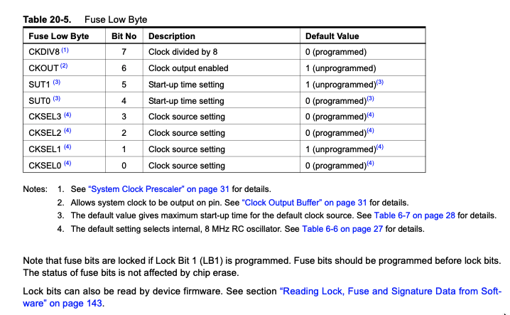

# ATtiny85 저전력 구동 가이드

## 1. 클럭 소스 선택

ATtiny85에는 여러 클럭 소스가 있으며, **퓨즈 비트**로 선택한다.

### Fuse Low Byte (lfuse) 구조



데이터시트 Table 20-5:

| Bit | 이름 | 설명 | 기본값 |
|-----|------|------|--------|
| 7 | CKDIV8 | 8분주 (0=활성, 1=비활성) | 0 (활성) |
| 6 | CKOUT | 클럭 출력 (0=출력, 1=안함) | 1 (안함) |
| 5 | SUT1 | Start-up time 설정 | 1 |
| 4 | SUT0 | Start-up time 설정 | 0 |
| 3 | CKSEL3 | 클럭 소스 설정 | 0 |
| 2 | CKSEL2 | 클럭 소스 설정 | 0 |
| 1 | CKSEL1 | 클럭 소스 설정 | 1 |
| 0 | CKSEL0 | 클럭 소스 설정 | 0 |

**주의: AVR 퓨즈는 0=programmed(활성), 1=unprogrammed(비활성)**

- CKDIV8: Section 6.2.6 "System Clock Prescaler" 참조
- CKOUT: Section 6.2.7 "Clock Output Buffer" 참조
- SUT: 클럭 소스마다 다른 표 참조 (8MHz RC → Table 6-4, 128kHz → Table 6-5)
- CKSEL: Table 6-1 참조

### CKSEL[3:0] 클럭 소스 (Table 6-1)

데이터시트 Table 6-1:

| CKSEL[3:0] | 클럭 소스 |
|------------|---------|
| 0010 | 8MHz 내부 RC 오실레이터 (기본) |
| 0100 | **128kHz 내부 오실레이터 (워치독)** |
| 0110 | 외부 저주파 크리스탈 |
| 1000~1111 | 외부 크리스탈/세라믹 |

### lfuse 계산 방법

lfuse 값은 각 비트를 조합해서 만든다:
```
lfuse = [CKDIV8] [CKOUT] [SUT1] [SUT0] [CKSEL3] [CKSEL2] [CKSEL1] [CKSEL0]
          bit7     bit6   bit5   bit4    bit3     bit2     bit1     bit0
```

예시: 1MHz를 만들려면
1. 클럭 소스: 8MHz RC → CKSEL = 0010
2. 8분주 활성: CKDIV8 = 0 (8MHz/8 = 1MHz)
3. 클럭 출력 안 함: CKOUT = 1
4. Start-up time: SUT = 10 (일반적)
```
lfuse = 0  1  1  0  0  0  1  0  = 0x62
```

### 클럭 설정 예시

| 원하는 클럭 | CKDIV8 | CKOUT | SUT | CKSEL | lfuse | 비고 |
|-----------|--------|-------|-----|-------|-------|------|
| 1MHz | 0 | 1 | 10 | 0010 | **0x62** | 8MHz/8 (기본) |
| 8MHz | 1 | 1 | 10 | 0010 | **0xE2** | 8MHz 그대로 |
| 128kHz | 1 | 1 | 10 | 0100 | **0xE4** | 워치독 오실레이터 |

CLKPR 레지스터로 런타임에 분주를 변경할 수도 있다:
```c
// 8MHz 퓨즈에서 2MHz로 변경 (런타임)
cli();
CLKPR = (1 << CLKPCE);    // 변경 허용 (4클럭 내에 다음 쓰기 필요)
CLKPR = (1 << CLKPS1);    // /4 → 8MHz/4 = 2MHz
sei();
```
CLKPR은 분주만 바꾸고 **오실레이터 자체는 그대로** 돌기 때문에 전력 절감 효과는 없다.

### 퓨즈 설정 방법

**방법 1: PlatformIO 업로드 시 자동 설정**

platformio.ini에서 `board_fuses.lfuse`와 `upload_command`를 설정하면
업로드 버튼 한번으로 퓨즈 + 플래시 동시에 적용:
```ini
board_fuses.lfuse = 0x62
upload_command = avrdude $UPLOAD_FLAGS -U lfuse:w:$BOARD_FUSES_LFUSE:m -U flash:w:$SOURCE:i
```

**방법 2: avrdude 직접 실행**
```bash
# 퓨즈 읽기
avrdude -p attiny85 -c stk500v1 -P /dev/tty.usbmodem11101 -b 19200 \
  -U lfuse:r:-:h

# 퓨즈만 쓰기 (1MHz)
avrdude -p attiny85 -c stk500v1 -P /dev/tty.usbmodem11101 -b 19200 \
  -U lfuse:w:0x62:m

# 퓨즈 + 플래시 동시에
avrdude -p attiny85 -c stk500v1 -P /dev/tty.usbmodem11101 -b 19200 \
  -U lfuse:w:0x62:m -U flash:w:firmware.hex:i
```

**주의: 퓨즈를 잘못 설정하면 칩이 벽돌될 수 있다** (예: 외부 크리스탈 선택했는데 크리스탈이 없는 경우)

### 128kHz 주의사항
- ISP 프로그래밍 시 SPI 클럭이 느려야 함 (< 128kHz/4 = 32kHz)
- ArduinoISP의 `SPI_CLOCK`을 `(128000/6)`로 변경 필요
- `micros()`, `delayMicroseconds()` 사용 불가
- Arduino 프레임워크(ATTinyCore)에서도 지원되지만 bare metal이 전력 효율 좋음
  - Arduino는 Timer0 인터럽트가 항상 동작 → 추가 전력 소비

### 클럭 변경 시 코드에서 바꿔야 할 것

| 항목 | 1MHz | 8MHz | 128kHz |
|------|------|------|--------|
| platformio.ini f_cpu | 1000000L | 8000000L | 128000L |
| platformio.ini lfuse | 0x62 | 0xE2 | 0xE4 |
| delay_ms 루프 카운트 | i=100 | i=800 | i=12 |
| I2C delay NOP 개수 | 2개 | 16개 | 없음 |
| 워치독 슬립 | 변경 불필요 | 변경 불필요 | 변경 불필요 |

## 2. 슬립 모드 (Power-down + Watchdog Wake-up)

### 원리
```
프레임 그리기 (1MHz, ~14ms) → Power-down 슬립 (~0.1µA) → 워치독으로 깨기 → 반복
```

Power-down 중에는:
- **8MHz RC 오실레이터 꺼짐**
- CPU, 모든 타이머 정지
- 워치독의 **128kHz 오실레이터만** 동작 (wake-up용)
- 소비 전류: **~0.1µA**
- OLED는 자체 RAM으로 화면 유지 (MCU와 무관)

### 워치독 타이머 프리스케일러

| WDP[3:0] | WDP3 | WDP2 | WDP1 | WDP0 | 시간 |
|----------|------|------|------|------|------|
| 0000 | 0 | 0 | 0 | 0 | ~16ms |
| 0001 | 0 | 0 | 0 | 1 | ~32ms |
| 0010 | 0 | 0 | 1 | 0 | ~64ms |
| 0011 | 0 | 0 | 1 | 1 | ~125ms |
| 0100 | 0 | 1 | 0 | 0 | ~250ms |
| 0101 | 0 | 1 | 0 | 1 | ~500ms |
| 0110 | 0 | 1 | 1 | 0 | ~1초 |
| 0111 | 0 | 1 | 1 | 1 | ~2초 |
| 1000 | 1 | 0 | 0 | 0 | ~4초 |
| 1001 | 1 | 0 | 0 | 1 | ~8초 |

### 코드 구현

```c
#include <avr/sleep.h>
#include <avr/interrupt.h>

// 워치독 인터럽트 핸들러 (빈 함수 — 깨우기만 함)
ISR(WDT_vect) {}

static void sleep_wdt(void) {
    cli();
    MCUSR &= ~(1 << WDRF);

    // WDTCR 타이밍 시퀀스: 4클럭 안에 두 번 써야 함
    // 인라인 어셈블리로 확실하게 보장
    __asm__ __volatile__(
        "ldi r16, %[wdce_wde]"   "\n\t"
        "ldi r17, %[wdie_wdp]"   "\n\t"
        "out %[wdtcr], r16"      "\n\t"   // 1. WDCE+WDE 설정
        "out %[wdtcr], r17"      "\n\t"   // 2. 4클럭 안에 WDP 설정
        :
        : [wdtcr] "I" (_SFR_IO_ADDR(WDTCR)),
          [wdce_wde] "M" ((1 << WDCE) | (1 << WDE)),
          [wdie_wdp] "M" ((1 << WDIE) | (1 << WDP1))  // ~64ms
        : "r16", "r17"
    );
    sei();

    set_sleep_mode(SLEEP_MODE_PWR_DOWN);
    sleep_enable();
    sleep_cpu();        // ← 여기서 잠듦. 깨면 다음 줄부터 실행.
    sleep_disable();

    // 워치독 비활성화
    cli();
    MCUSR &= ~(1 << WDRF);
    __asm__ __volatile__(
        "ldi r16, %[wdce_wde]"   "\n\t"
        "ldi r17, 0"             "\n\t"
        "out %[wdtcr], r16"      "\n\t"
        "out %[wdtcr], r17"      "\n\t"
        :
        : [wdtcr] "I" (_SFR_IO_ADDR(WDTCR)),
          [wdce_wde] "M" ((1 << WDCE) | (1 << WDE))
        : "r16", "r17"
    );
    sei();
}
```

### WDTCR 타이밍 시퀀스 설명

ATtiny85 데이터시트에 따르면, WDTCR 레지스터를 변경하려면:
1. WDCE와 WDE를 동시에 1로 쓴다
2. **4클럭 이내에** 원하는 WDP, WDIE 값을 쓴다

C 코드로 두 줄 연속 쓰면 컴파일러가 중간에 다른 명령어를 넣을 수 있어서,
인라인 어셈블리로 `out` 명령 2개를 연속 배치해야 확실하다.

### 슬립 시간 변경 예시

```c
// 64ms 슬립
[wdie_wdp] "M" ((1 << WDIE) | (1 << WDP1))

// 125ms 슬립
[wdie_wdp] "M" ((1 << WDIE) | (1 << WDP1) | (1 << WDP0))

// 250ms 슬립
[wdie_wdp] "M" ((1 << WDIE) | (1 << WDP2))

// 1초 슬립
[wdie_wdp] "M" ((1 << WDIE) | (1 << WDP2) | (1 << WDP1))
```

### 메인 루프 사용법

```c
while (1) {
    // 1MHz에서 빠르게 프레임 그리기 (~14ms)
    draw_frame();

    // Power-down 슬립 (~0.1µA)
    sleep_wdt();

    // ← 워치독 타이머 만료 후 여기서 재개
}
```

## 3. 전력 비교

### 클럭별 활성 전류 (OLED 제외)
| 클럭 | 활성 전류 | 비고 |
|------|----------|------|
| 8MHz | ~5mA | 피크 높음, 코인셀 주의 |
| 1MHz | ~1mA | 무선전력에 적합 |
| 128kHz | ~0.2mA | I2C 느림 |

### 구동 방식별 평균 전류 (MCU만, OLED 제외)
| 방식 | 활성 | 슬립 | 슬립 비율 | 평균 전류 |
|------|------|------|----------|----------|
| 1MHz 상시 | ~1mA | - | 0% | ~1mA |
| 128kHz 상시 | ~0.2mA | - | 0% | ~0.2mA |
| 1MHz + 64ms 슬립 | ~1mA | 0.1µA | 82% | ~0.18mA |
| 1MHz + 125ms 슬립 | ~1mA | 0.1µA | 90% | ~0.10mA |
| 1MHz + 250ms 슬립 | ~1mA | 0.1µA | 95% | ~0.05mA |

**1MHz + 슬립 모드가 128kHz 상시보다 전력 효율이 높다.**
(128kHz는 8MHz 오실레이터가 계속 돌지만, 슬립에서는 오실레이터가 완전히 꺼진다)

## 4. 추가 전력 절약

### ADC 비활성화
```c
ADCSRA &= ~(1 << ADEN);  // ADC 끄기 (사용 안 할 때)
```

### 미사용 주변장치 끄기
```c
PRR = (1 << PRTIM1) | (1 << PRUSI);  // Timer1, USI 끄기
```

### OLED 전력 절약
- contrast 낮추기: `ssd1306_cmd2(0x81, 0x01)`
- 내부 IREF 19µA: `ssd1306_cmd2(0xAD, 0x10)`
- 디스플레이 클럭 낮추기: `ssd1306_cmd2(0xD5, 0x11)` (140kHz)
- 표시 안 할 때 끄기: `ssd1306_cmd(0xAE)`

## 5. bare metal vs Arduino 프레임워크

| | bare metal | Arduino (ATTinyCore) |
|---|---|---|
| 128kHz 지원 | O | O (제한적) |
| Timer0 인터럽트 | 없음 | **항상 동작** (전력 소비) |
| Flash 사용 | ~1900 bytes | ~3200 bytes |
| 전력 | 낮음 | 상대적으로 높음 |
| delay/millis | 직접 구현 | 내장 |
| 라이브러리 | 직접 작성 | TinyWireM, Tiny4kOLED 등 |

bare metal이 전력 효율은 좋지만 코드를 직접 짜야 함.

## 6. platformio.ini 설정

### 1MHz bare metal (현재)
```ini
[env:program_via_ArduinoISP]
platform = atmelavr
board = attiny85
upload_speed = 19200
board_build.f_cpu = 1000000L
board_fuses.lfuse = 0x62
```

### 128kHz bare metal
```ini
board_build.f_cpu = 128000L
board_fuses.lfuse = 0xE4
```
주의: ArduinoISP의 SPI_CLOCK을 `(128000/6)`로 변경 필요

### 퓨즈 쓰기 (avrdude 직접)
```bash
# platformio.ini의 upload_command는 flash만 쓰므로, 퓨즈는 별도로:
~/.platformio/packages/tool-avrdude/bin/avrdude \
  -C ~/.platformio/packages/tool-avrdude/avrdude.conf \
  -p attiny85 -P /dev/tty.usbmodem11101 -b 19200 -c stk500v1 \
  -U lfuse:w:0x62:m \
  -U flash:w:.pio/build/program_via_ArduinoISP/firmware.hex:i
```
