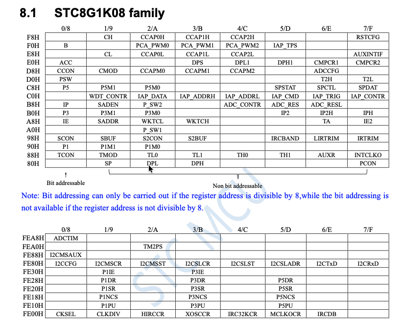
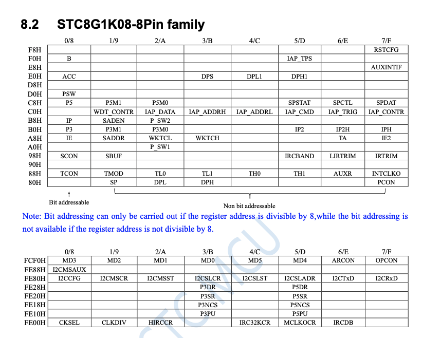
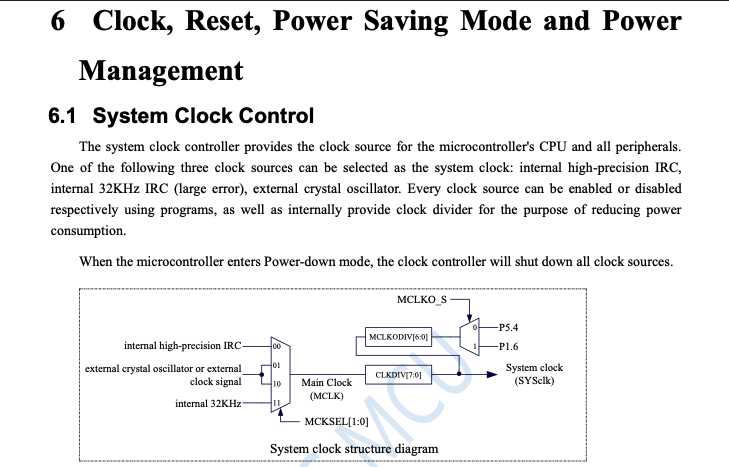
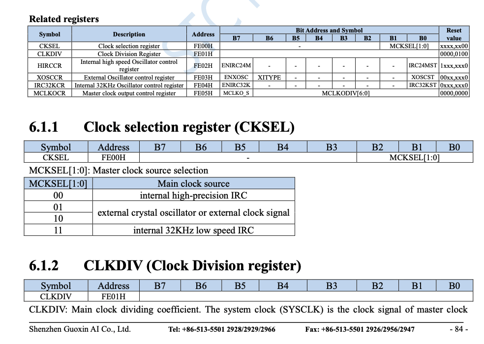
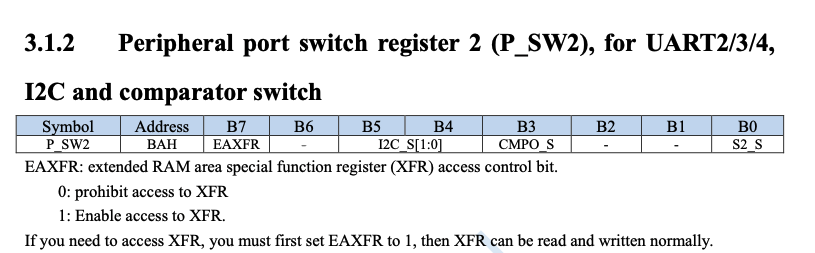
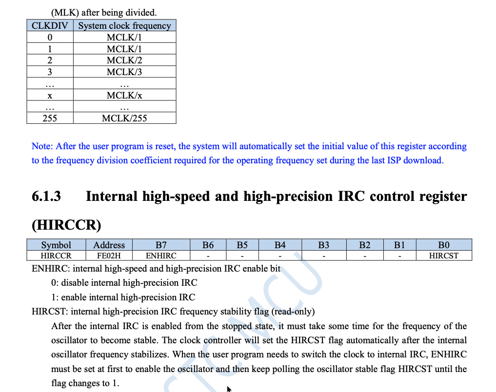
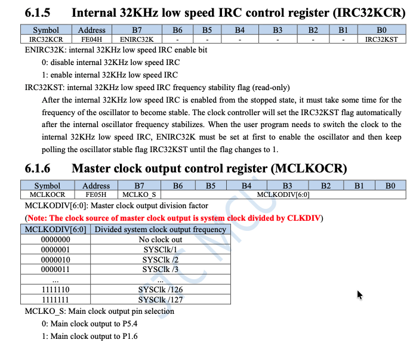
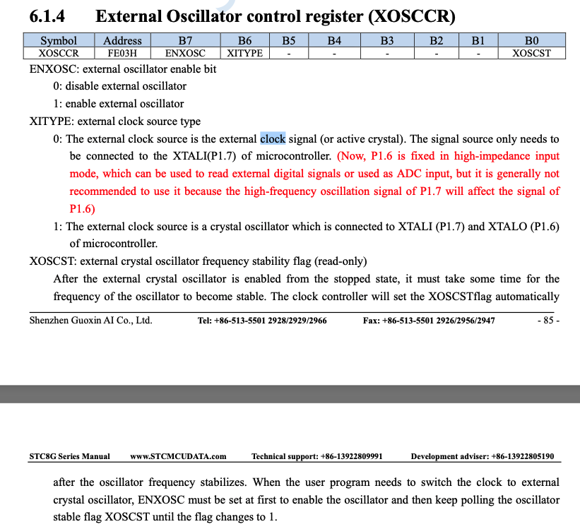
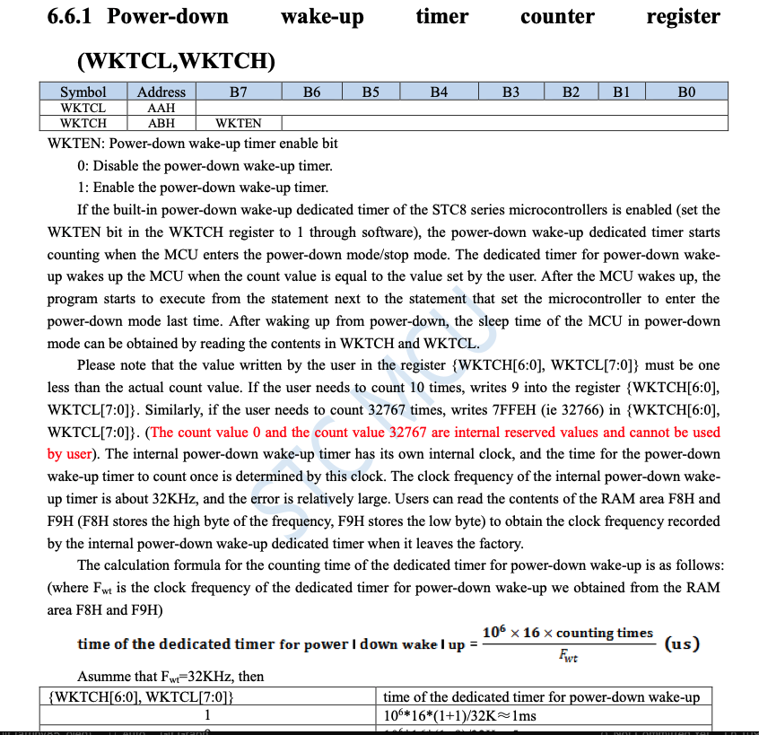
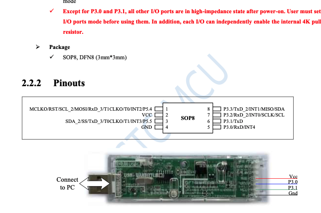

# STC8G1K08-8PIN 레지스터 설정 가이드


## 1. 레지스터 맵 읽는 법

참고: STC8G1K08 풀 버전 (8.1):



데이터시트 8.2절 (STC8G1K08-8Pin family):




**주소 = 행 주소 + 열 오프셋**

```
        0/8    1/9    2/A    3/B    4/C    5/D    6/E    7/F    <- 오프셋
FE00H   CKSEL  CLKDIV HIRCCR        IRC32KCR MCLKOCR        IRCDB
B8H     IP     SADEN  P_SW2
A8H     IE     SADDR  WKTCL  WKTCH
```

예시:
- P_SW2 = B8H + 2 = **0xBA** (주의: 0xA2는 P_SW1!)
- WKTCL = A8H + 2 = **0xAA**
- IRC32KCR = FE00H + 4 = **0xFE04**

**주소 표기법:**
- 데이터시트: `AAH` (H = Hexadecimal)
- C 코드: `0xAA` (0x = 16진수)
- 둘 다 같은 값

## 2. 레지스터 종류

#### 8051 아키텍처 (STC8G 기반)
  ##### 8051 메모리 맵:     
  > 00H ~ 7FH   → 일반 RAM (128바이트, 변수 저장용) 
  80H ~ FFH   → SFR 영역 (128바이트, 하드웨어 제어용)  
  ##### 8051은 8비트 아키텍처
  > 레지스터 하나당 8비트
  ##### Bit Addressing 은 /8 단위만 직접 수정 가능 (8051 특성)
  * 참고 : https://blog.naver.com/songsite123/223078599290
  * 8.2 에서 P5 같은 경우 C8H (0xC8) 이라 /8 가능하므로
  ```
  __sfr  __at(0xC8) P5;
  ```
   를 하면 0xC8에 있는 P5 레지스터에 접근을 함 (Assembly 어로는 **MOV**)
  그후 
  
  > P5 = 0xC8
  0xC8 → bit0 (P5_0)
  0xC9 → bit1 (P5_1)
  0xCA → bit2 (P5_2)
  0xCB → bit3 (P5_3)
  0xCC → bit4 (P5_4) 
  0xCD → bit5 (P5_5)
  
  의 **비트 접근 특성**으로
  ```
  __sbit __at(0xCC) P5_4;
  ```
  를 하면 (Assembly 어로는 **SETB/CLR**)
  ```
   P5_4 = 1;          // P5의 bit4 = 1
  P5_4 = 0;          // P5의 bit4 = 0            
  if (P5_4) { ... }  // P5의 bit4 읽기  
  ```
  와 같이 사용 가능

  * 그 외의 다른 주소는 (%8 != 0) **bit 연산**으로 가능
  ``` 
  __sfr  __at(0xC9) P5M1;
  P5M1 |= (1 << 4);    // P5M1의 bit4 = 1 
  P5M1 &= ~(1 << 4);   // P5M1의 bit4 = 0 
  if (P5M1 & (1 << 4)) { ... }  // P5M1의 bit4 읽기 
  ```


### 일반 SFR(Special Function Register) (80H~FFH)
직접 접근 가능:
```c
__sfr __at(0xAA) WKTCL;   // 선언 (바이트 접근)
```


## 3. 클럭 설정

### STC8g에 3가지 클럭 구동 방식이 있음

* Internal high-precision IRC (**HIRC**)
* Internal 32KHz IRC (**IRC32K**)
* External crystal oscillator (**XOSC**)

### 클럭 구조



### CKSEL, CLKDIV 레지스터



### 확장 SFR (FE00H~FEFFH)
사용 할 클락을 선택할 레지스터인 **CKSEL**의 주소는 FE00H인데, FE00H~FEFFH는 확장 SFR (**EAXFR**)이고 이를 사용하려면, P_SW2의 EAXFR 비트를 켜야 접근 가능:

```c
// 선언 (xdata 포인터)
#define HIRCCR  (*(unsigned char volatile __xdata *)0xFE02)

// 사용 예시
__sfr  __at(0xBA) P_SW2;
P_SW2 |= (1 << 7); // EAXFR 활성화 (P_SW2 bit7) (or P_SW2 = 0x80;)
HIRCCR |= (1 << 7);    // 확장 SFR에 쓰기 (ENHIRC 활성화)
P_SW2 |= (0 << 7); // EAXFR 다시 비활성화
```


**CKSEL (0xFE00)** - 클럭 소스 선택:
| MCKSEL[1:0] | 클럭 소스 |
|-------------|---------|
| 00 | 내부 고속 IRC |
| 01 | 외부 크리스탈/클럭 |
| 10 | 외부 크리스탈/클럭 |
| 11 | 내부 32KHz IRC |

**CLKDIV (0xFE01)** - 분주:
| 값 | 시스템 클럭 |
|----|-----------|
| 0, 1 | MCLK / 1 |
| N | MCLK / N |
| 255 | MCLK / 255 |

### HIRCCR, CLKDIV 테이블



**HIRCCR (0xFE02)** - 고속 IRC 제어:
| Bit | 이름 | 설명 |
|-----|------|------|
| 7 | ENHIRC | 1=활성화, 0=비활성화 |
| 0 | HIRCST | 안정화 플래그 (읽기 전용) |

### IRC32KCR 레지스터



**IRC32KCR (0xFE04)** - 32KHz IRC 제어:
| Bit | 이름 | 설명 |
|-----|------|------|
| 7 | ENIRC32K | 1=활성화, 0=비활성화 |
| 0 | IRC32KST | 안정화 플래그 (읽기 전용) |

### XOSCCR 레지스터



**XOSCCR (0xFE03)** - 외부 오실레이터 (8-Pin에서는 물리적 핀 없음):
| Bit | 이름 | 설명 |
|-----|------|------|
| 7 | ENXOSC | 1=활성화, 0=비활성화 |
| 6 | XITYPE | 0=외부 클럭, 1=크리스탈 |
| 0 | XOSCST | 안정화 플래그 (읽기 전용) |

### 32KHz IRC 전환 코드 예시
```c
__sfr  __at(0xBA) P_SW2; // (__sfr은 80H~FFH 범위만 지원)
#define CKSEL (*(unsigned char volatile __xdata *)0xFE00)

// 32KHz → 고속 IRC로 돌아가기
#define HIRCCR (*(unsigned char volatile __xdata *)0xFE02)

P_SW2 = 0x80;     
HIRCCR = 0x80;              // 1. 고속 IRC 켜기
while (!(HIRCCR & 0x01));   // 2. 안정화 대기 (또는 딜레이 함수 (delay_ms(500)) -  폴링 동작 안할 시)   
CKSEL = 0x00;               // 3. 클럭 소스를 고속 IRC로 전환
IRC32KCR = 0x00;            // 4. 32KHz IRC 끄기 (절전) 
P_SW2 = 0x00;  


// 고속 IRC → 32KHz로 돌아가기
#define IRC32KCR (*(unsigned char volatile __xdata *) 0xFE04)

P_SW2 = 0x80;               // EAXFR enable
IRC32KCR = 0x80;            // 1. 32KHz IRC 활성화
while (!(IRC32KCR & 0x01)); // 2. 안정화 대기 (또는 딜레이 함수)
CKSEL = 0x03;               // 3. 32KHz IRC로 전환
HIRCCR = 0x00;              // 4. 고속 IRC 비활성화 (절전)
P_SW2 = 0x00;               // EAXFR 비활성화
```

## 4. Power-down (STOP) 모드

### WKTCL/WKTCH - wake-up 타이머



**PCON (0x87):**
| Bit | 이름 | 설명 |
|-----|------|------|
| 1 | PD | 1 쓰면 power-down 진입 |

**WKTCL (0xAA), WKTCH (0xAB):**
```
WKTCH: [WKTEN] [카운터 bit14-8]    (bit7 = 활성화)
WKTCL: [카운터 bit7-0]
```

- **쓰는 값 = 원하는 카운트 - 1** (0과 32767은 예약)
- 카운터 = {WKTCH[6:0], WKTCL[7:0]} (15비트)

### wake-up 시간 계산 공식
```
시간(us) = 10^6 x 16 x counting_times / F_wt
```
F_wt = ~32,000Hz (내부 wake-up 타이머 클럭)

| 원하는 시간 | 카운트 | 쓰는 값 | WKTCL | WKTCH |
|-----------|--------|--------|-------|-------|
| ~1ms | 2 | 1 | 0x01 | 0x80 |
| ~50ms | 100 | 99 | 0x63 | 0x80 |
| ~100ms | 200 | 199 | 0xC7 | 0x80 |
| ~200ms | 400 | 399 | 0x8F | 0x81 |
| ~500ms | 1000 | 999 | 0xE7 | 0x83 |
| ~1s | 2000 | 1999 | 0xCF | 0x87 |

### STOP 모드 사용 코드
```c
// wake-up 타이머 설정 (~200ms)
WKTCL = 0x8F;           // (399) & 0xFF
WKTCH = 0x81;           // bit7=enable | (399 >> 8)

// power-down 진입
PCON |= 0x02;           // PD 비트 -> 즉시 정지
__asm nop __endasm;     // wake-up 후 여기서 실행 재개
__asm nop __endasm;
```

**STOP 모드 동안:**
- 모든 클럭 소스 정지 (고속 IRC 포함)
- 소비 전류: ~0.4uA
- wake-up 타이머만 동작
- wake-up 후 PCON PD 비트 자동 클리어

## 5. I2C 핀 설정 (소프트웨어 비트뱅잉)

### P3M0, P3M1 - 포트 모드
| P3M1.x | P3M0.x | 모드 |
|--------|--------|------|
| 0 | 0 | 준양방향 (기본) |
| 0 | 1 | 푸시풀 출력 |
| 1 | 0 | 고임피던스 입력 |
| 1 | 1 | 오픈드레인 |

I2C는 오픈드레인 필요:
```c
P3M0 |= 0x0C;   // P3.2, P3.3 bit set
P3M1 |= 0x0C;   // P3.2, P3.3 bit set -> 오픈드레인
```

## 6. STC8G1K08-8PIN 핀아웃



```
         STC8G1K08 SOP8
         +----------+
 P5.4  1 |          | 8  P3.3 (SDA/I2C)
  VCC  2 |          | 7  P3.2 (SCL/I2C)
 P5.5  3 |          | 6  P3.1 (TxD/프로그래밍)
  GND  4 |          | 5  P3.0 (RxD/프로그래밍)
         +----------+
```

## 7. 프로그래밍 (stcgal + CH340C)

```
CH340C TX  -> Pin 5 (P3.0/RxD)
CH340C RX  -> Pin 6 (P3.1/TxD)
CH340C GND -> Pin 4 (GND)
CH340C VCC -> Pin 2 (VCC) - 분리 가능하게
```

```bash
# stcgal 직접 실행
python3 stcgal.py -P stc8g -p /dev/tty.usbserial-10 -b 9600 -t 11059 firmware.hex
```

**VCC를 뽑았다 꽂아야 ISP 모드 진입** (콜드 부팅 필요)

## 8. 참고 사항

- 데이터시트: http://www.stcmcudata.com/STC8F-DATASHEET/STC8G-EN.pdf
- 고속 IRC 범위: 4MHz ~ 36MHz (ISP에서 트리밍)
- 32KHz IRC: 오차가 큼, power-down wake-up용
- Arduino를 USB-TTL로 쓰면 보드레이트 전환 문제 발생 -> CH340C 사용 권장
