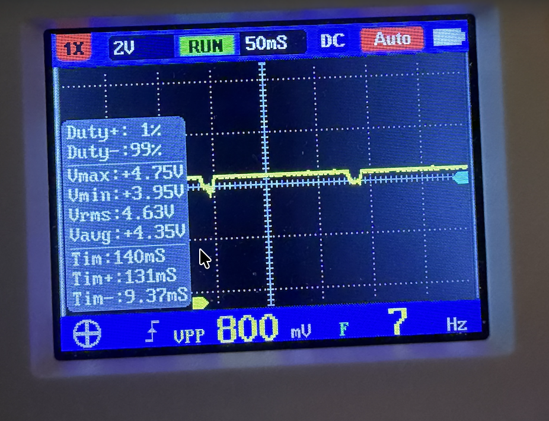
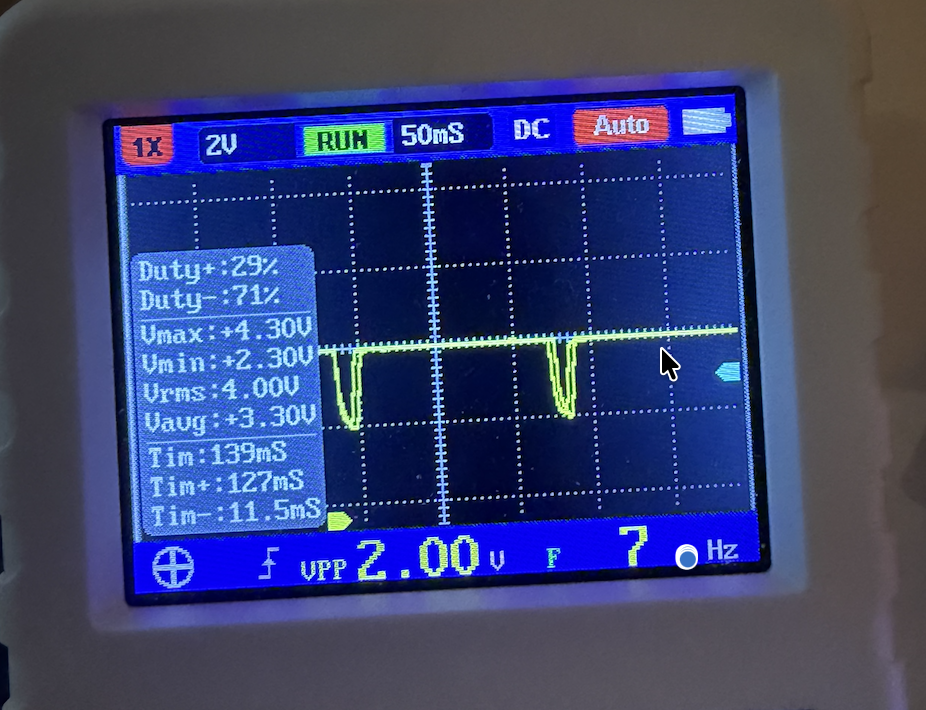
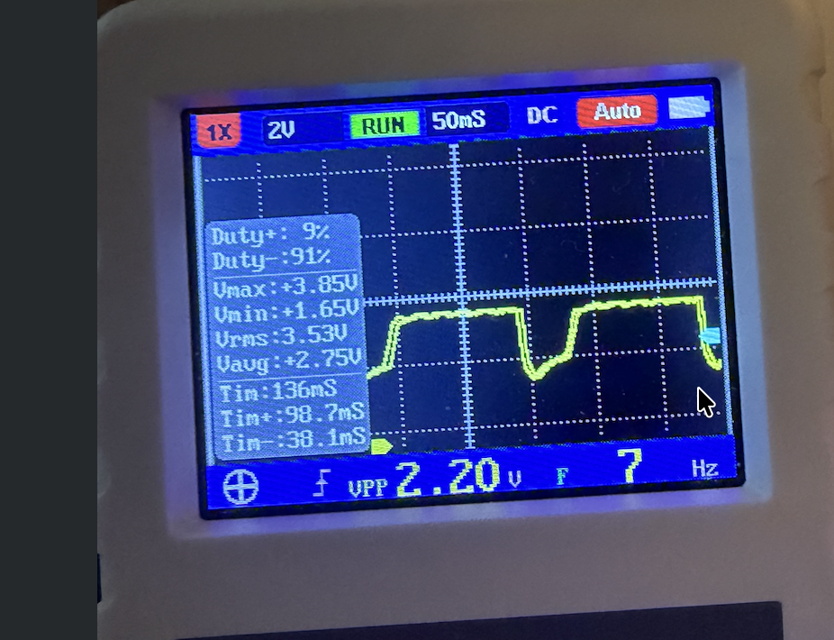
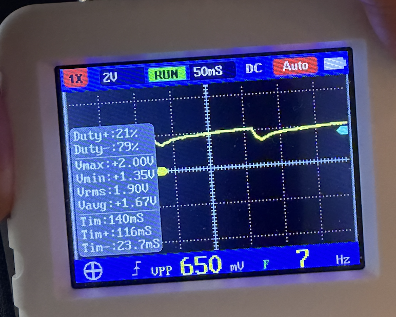
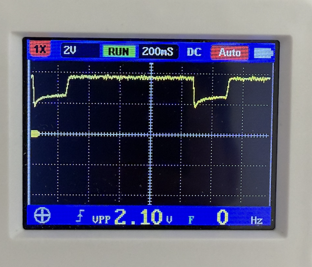
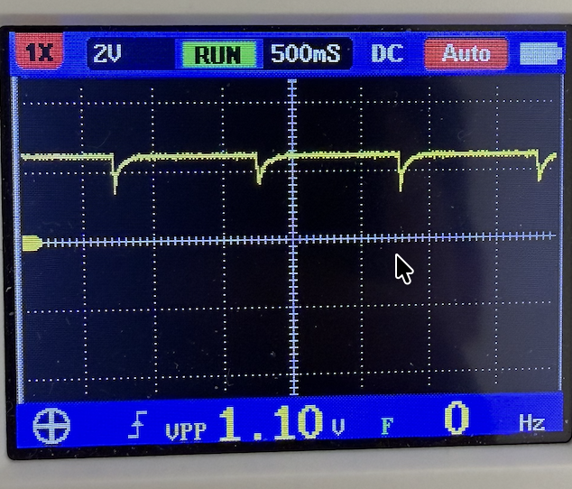
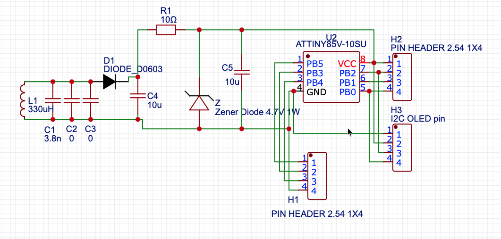
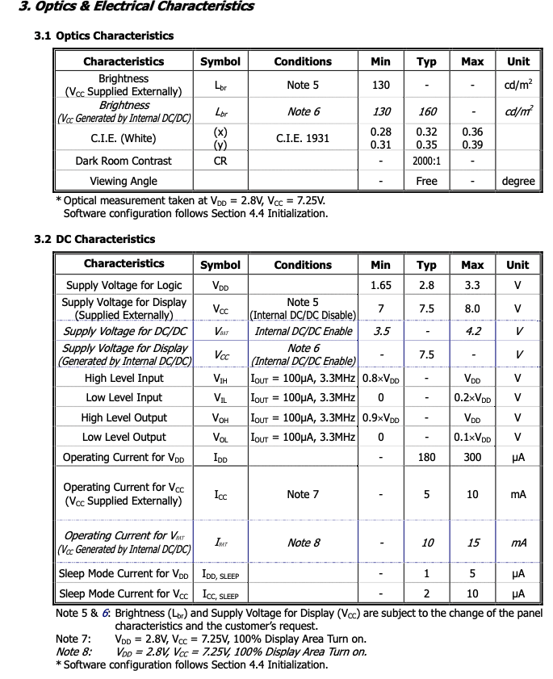
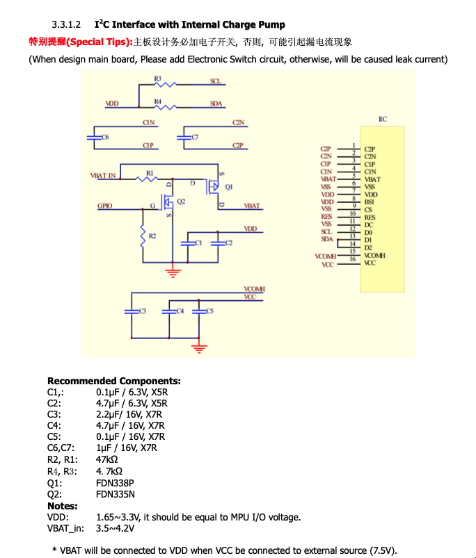

# VCC Voltage Sag Analysis

ATtiny85 + SSD1306 OLED 구동 시 공급 전압에 따른 VCC 파형 변화 분석.

## 시스템 개요

- ATtiny85 (8MHz) + SSD1306 OLED (72x40, I2C)
- 메인 루프: `read_vcc()` → I2C로 OLED 화면 갱신 → `sleep_125ms()` (WDT power-down)
- 전체 사이클: ~140ms (활성 ~14ms + sleep ~125ms), 약 7Hz

## 측정 파형

VCC 전원 라인을 오실로스코프로 측정한 결과, 공급 전압에 따라 전압 강하(sag) 양상이 크게 달라진다.

### 공급 전압 높음 (Vmax: 4.75V)



| 항목 | 값 |
|------|-----|
| Vmax | +4.75V |
| Vmin | +3.95V |
| Vpp | 800mV |
| Vavg | +4.35V |
| Tim+ | 131ms |
| Tim- | 9.37ms |

활성 구간(~14ms)에서 소폭 딥 발생 후 즉시 회복. 전압 강하가 작고 회복이 빠르다.

### 공급 전압 중간 (Vmax: 4.30V)



| 항목 | 값 |
|------|-----|
| Vmax | +4.30V |
| Vmin | +2.30V |
| Vpp | 2.00V |
| Vavg | +3.30V |
| Tim+ | 127ms |
| Tim- | 11.5ms |

뾰족한 V자 딥 발생. 전압이 2.30V까지 떨어졌다가 빠르게 회복한다.

### 공급 전압 낮음 (Vmax: 3.85V)



| 항목 | 값 |
|------|-----|
| Vmax | +3.85V |
| Vmin | +1.65V |
| Vpp | 2.20V |
| Vavg | +2.75V |
| Tim+ | 98.7ms |
| Tim- | 38.1ms |

넓고 깊은 U자 딥 발생. MCU 활성 시간은 ~14ms로 동일하지만, 전압이 눌린 채로 **38ms 동안** 유지된다. 회복 시 서서히 올라가다가 **급등**하는 특징적인 형태를 보인다.

### 공급 전압 매우 낮음 (Vmax: 2.00V)



| 항목 | 값 |
|------|-----|
| Vmax | +2.00V |
| Vmin | +1.35V |
| Vpp | 650mV |
| Vavg | +1.67V |
| Tim+ | 116ms |
| Tim- | 23.7ms |

완만한 딥만 발생하고 **급등 현상이 나타나지 않는다**. 캐패시턴스(20μF)가 부족하여 MCU 활성 구간에서 전하가 고갈되고, charge pump이 안정적으로 동작할 수 있는 전압을 유지하지 못한다. OLED는 어둡지만 동작하며, 이는 불완전한 승압으로 일부 픽셀이 구동되기 때문이다.

### 1s sleep 실험 + 100μF 캐패시터 추가 실험

#### 1s sleep, ~3.7-3.8V: 충전 완료까지 ~200-250ms



Sleep을 1s로 늘리면 꺾임점(3구간 전환)이 관측된다. 단, 125ms sleep에서의 ~28ms 대비 충전 완료까지 **200-250ms**가 소요된다. 낮은 VBAT에서 charge pump 효율이 떨어져 C6/C7 충전율이 낮아지기 때문이다.

#### 1s sleep, ~3.6-3.7V 미만: 시간을 줘도 부스트 불가



1초를 줘도 꺾임점이 나타나지 않는다. 20μF 캐패시턴스에서는 이 전압 범위에서 charge pump이 전류를 끌어갈 때 전압이 유지되지 못하고 ~2V까지 붕괴한다.

#### 100μF 추가: 2.5~3.5V에서 정상 동작

C5에 100μF을 추가하면 상황이 바뀐다:

| 공급 전압 | 리플 | 동작 상태 |
|-----------|------|-----------|
| 2.5 ~ 3.5V | ~0.2V | **정상 동작**. Charge pump이 안정적으로 승압 |
| < 2.5V | ~0.2V | 1.65V로 급락. Charge pump 전력 부족 |

이 결과는 **charge pump 미동작의 원인이 전압 자체가 아니라 캐패시터의 전하량 부족**이었음을 보여준다. OLED 모듈 자체도 내부 LDO(662K)를 통해 VBAT = 3.3V (데이터시트 V_MT min 3.5V 미만)로 정상 동작하고 있으며, 이는 안정적인 전압만 유지되면 스펙 이하에서도 charge pump이 동작함을 확인해준다.

20μF에서 실패했던 이유:

```
MCU 활성 → 큰 전류 → 작은 캡 전하 고갈 → 전압 붕괴
→ charge pump도 전하 소비 → 전압 더 하강 → 양의 피드백 → 붕괴
→ 문제는 "전압"이 아니라 "전하"
```

100μF에서 성공하는 이유:

```
MCU 활성 → 큰 전류 → 큰 캡이 전하 공급 → 전압 안정 (리플 ~0.2V)
→ charge pump이 안정적으로 동작 → 정상 승압
```

## 회로



```
                R1 (10Ω)
  L1       D1  ┌─/\/\/─┬────────┬──────────┐
 ┌──┐    ┌─|>|─┤       │        │          │
 │  │    │     │       │       ═╪═ C5      │
 │  ├────┘    ═╪═ C4  ═╪═ Z     │ 10μF     ├─── VCC (ATtiny85 + OLED)
 │  │    330μH │ 10μF  │ 4.7V   │          │
 │  │          │       │        │          │
 └──┘──────────┴───────┴────────┴──────────┘─── GND
C1 3.8nF
```

- **L1 (330μH) + C1 (3.8nF)**: LC 공진 수신 코일 (인덕티브 커플링, 약 142kHz)
- **D1**: 정류 다이오드
- **C4 (10μF)**: 주 에너지 저장 캐패시터
- **Z (4.7V Zener)**: 과전압 클램프
- **R1 (10Ω)**: C4와 VCC 사이 직렬 저항
- **C5 (10μF)**: VCC 바이패스 캐패시터

전원은 정전압원이 아니라 **인덕티브 커플링을 통한 제한된 전력 공급원**이다. 코일 커플링 강도에 따라 공급 가능한 전력이 결정되며, 부하가 공급을 초과하면 C4, C5가 방전된다.

## SSD1306 DC 특성 (데이터시트)



| 항목 | Symbol | Min | Typ | Max | Unit |
|------|--------|-----|-----|-----|------|
| Charge pump 입력 전압 | V_MT | 3.5 | - | 4.2 | V |
| Charge pump 동작 전류 | I_MT | - | 10 | 15 | mA |
| 로직 동작 전류 | I_DD | - | 180 | 300 | μA |
| Sleep 전류 (V_CC) | I_CC,SLEEP | - | 2 | 10 | μA |

**V_MT min = 3.5V**: VCC가 3.5V 아래로 떨어지면 charge pump가 정상 동작할 수 없다.

### Charge pump 내부 캐패시터 (데이터시트)



| 캡 | 용량 | 위치 | 역할 |
|----|------|------|------|
| C3 | 2.2μF | VCOMH (~3.5V) | COM 전압 저장 |
| C4 | 4.7μF | VCC (~7.5V) | 승압 출력 저장 |
| C5 | 0.1μF | VCC (~7.5V) | 승압 출력 바이패스 (C4와 병렬) |
| C6, C7 | 1μF | C1P-C1N, C2P-C2N | flying cap (차지 펌프 스위칭) |
| C1 | 0.1μF | VDD | 로직 바이패스 |
| C2 | 4.7μF | VDD | 로직 바이패스 |

## 원인 분석

### 공급 전압에 따라 드롭이 달라지는 이유

SSD1306 charge pump는 OLED 구동을 위해 일정한 전력 `P`를 소비한다. 데이터시트 기준 I_MT = 10~15mA (typ 10mA). 입력 전류는:

```
I_oled = P / V
```

VCC가 낮을수록 동일 전력에 대해 더 큰 전류가 필요하다. 전류가 클수록 C4, C5에서 더 빨리, 더 깊이 방전된다. 이것이 공급 전압이 4.75V → 3.85V로 0.9V만 줄어도, 전압 강하가 0.8V (4.75 -> 3.95) → 2.2V (3.85 -> 1.65) 로 약 3배 차이 나는 이유다.

바이패스 캐패시터의 크기도 전압 강하 깊이를 결정한다. C가 크면 `dV/dt = I/C`가 작아지므로 14ms 동안 전압이 덜 떨어진다.

### 파형의 3구간 분석 (Image 3 기준)

저전압(3.85V) 파형을 기준으로 세 구간으로 나눠 분석한다.

#### 1구간: MCU 활성 (0 ~ 14ms) — C4, C5 방전

MCU가 깨어나 ADC 읽기 + I2C 통신을 수행한다. MCU 활성 전류 + OLED 전류가 코일의 공급 능력을 초과한다. 부족분을 C5가 직접 방전하여 보충하고, C4도 R1을 통해 방전된다 (R1×C5 = 100μs << 14ms이므로 C5는 C4를 빠르게 따라감).

`I_oled = P/V`이므로 V가 떨어질수록 전류가 더 커지고, 방전이 가속된다.

VCC가 크게 떨어지면 SSD1306 charge pump의 **출력 측 캐패시터** (승압된 7~8V를 저장하는 캡 + VCOMH 캡)도 함께 방전된다.

#### 2구간: Charge pump 출력 재충전 (14ms ~ 42ms) — 느린 회복

MCU가 sleep에 진입하여 `I_mcu ≈ 0`이 된다. 코일이 C4를 재충전하기 시작한다.

그러나 SSD1306 charge pump는 1구간에서 방전된 **출력 측 캐패시터**를 목표 전압(~7.5V)까지 재충전해야 한다. 이를 위해 charge pump는 **최대 듀티로 동작**하며 VCC에서 큰 전류를 끌어간다.

코일에서 들어오는 전류가 OLED charge pump 재충전과 C4/C5 충전으로 분배되어 VCC가 완만하게 상승한다.

재충전에 필요한 에너지 (데이터시트 기준):

C6, C7은 flying cap으로 매 스위칭 사이클마다 VBAT 레벨로 충방전을 반복하는 셔틀이다. VBAT가 회복되면 다음 사이클에 즉시 적응하므로 별도의 재충전 시간이 불필요하다. C1, C2는 VDD 바이패스 캡으로 외부 VCC 라인의 캐패시턴스에 합산될 뿐이다.

재충전이 필요한 것은 **출력 저장 캡**인 C4(+C5)와 C3이다:

```
C4+C5 (4.7+0.1μF @ VCC ~7.5V):    0.5 × 4.8μF × 7.5²  ≈ 135μJ
C3 (2.2μF @ VCOMH ~0.77×7.5=5.8V): 0.5 × 2.2μF × 5.8²  ≈ 37μJ
합계:                                 ≈ 172μJ

VBAT = 2V, 효율 30% 가정 시:
필요 입력 에너지 = 172 / 0.3 ≈ 573μJ
입력 전하 = 573μJ / 2V = 287μC
I_MT = 10mA 기준: 287μC / 10mA = 29ms
I_MT = 5mA 기준:  287μC / 5mA  = 57ms
```

Image 3의 2구간 지속 시간(~28ms)은 이 범위(25~49ms) 안에 있다.

#### 3구간: 급속 회복 (42ms ~ 140ms) — C4, C5 급속 충전

SSD1306 charge pump의 출력 캐패시터가 목표 전압에 도달한다. Charge pump가 **최대 듀티 충전 모드에서 정상 레귤레이션 모드로 전환**되면서 입력 전류가 급감한다.

이것은 이산적(discrete) 전환이다. 파형에서 **미분 불가능한 꺾임점**으로 관측되며, 양의 피드백에 의한 연속적 가속과는 구별된다.

부하가 급감하면서 코일의 공급 전류가 거의 전부 C4/C5 충전으로 흘러가고, VCC가 급등한다.

### 고전압(Image 1)에서 딥이 작은 이유

커플링이 강하면 코일 공급 전력이 충분하여:

1. `I_oled = P/V`에서 V가 크므로 전류가 작다 → C4, C5 방전이 적다
2. 1구간에서 전압 강하가 작으므로 charge pump 출력 캡의 방전도 적다
3. 2구간(재충전)이 짧거나 거의 없다 → 즉시 3구간으로 진입하여 빠르게 회복

## 핵심 요약

| 현상 | 원인 |
|------|------|
| 공급 전압이 낮을수록 딥이 깊음 | `I = P/V` — 낮은 VCC에서 동일 전력에 더 큰 전류 필요, C4/C5가 더 깊이 방전 |
| 딥이 14ms(활성 시간)보다 훨씬 길게 지속 | Sleep 후에도 charge pump가 출력 캡을 최대 듀티로 재충전하며 큰 전류 소비 |
| 서서히 올라가다 급등 (미분 불연속) | Charge pump 출력이 목표 전압 도달 → 최대 듀티에서 레귤레이션 모드로 이산적 전환 → 부하 급감 |
| 캐패시터가 크면 딥이 줄어듦 | `dV/dt = I/C` — 동일 전류에 C가 크면 전압 변화율 감소 |
| 2.00V에서 급등 없음 | 캡 전하 부족 → 전압 붕괴 → charge pump 충전 완료 불가 |
| 100μF 추가 시 2.5~3.5V 정상 동작 | 전하량 충분 → 전압 안정 → charge pump 정상 승압 (전압이 아닌 전하가 핵심) |

## 캐패시터 용량 설계

### 부족 전류 역산

측정 파형에서 1구간(14ms)의 전압 강하와 기존 캐패시턴스로부터 부족 전류를 역산할 수 있다.

```
I_deficit = C_total × ΔV / t
```

현재 C_total = C4 + C5 = 20μF (R1×C5 = 100μs << 14ms이므로 사실상 병렬).

| 파형 | Vmax | ΔV | I_deficit (평균) | Vavg (1구간) |
|------|------|----|-----------------|-------------|
| Image 1 (4.75V) | 4.75V | 0.8V | 1.1mA | 4.35V |
| Image 2 (4.30V) | 4.30V | 2.0V | 2.9mA | 3.30V |
| Image 3 (3.85V) | 3.85V | 2.2V | 3.1mA | 2.75V |
| Image 4 (2.00V) | 2.00V | 0.65V | 0.9mA | 1.68V |

보간에는 **2구간(느린 회복)이 뚜렷하게 존재하는 파형만** 유효하다. Image 1은 커플링이 강해서 부족분이 거의 없고(코일이 대부분 감당), Image 4는 전체 전압이 너무 낮아 OLED 소비 자체가 적다. 따라서 **Image 2, 3만** 보간 기준으로 사용한다.

### 목표 ΔV에 필요한 캐패시턴스

특정 동작 전압 `V_op`에서 전압 강하를 `ΔV_target` 이하로 제한하려면:

```
C ≥ I_deficit(V_op) × t_active / ΔV_target
```

`I_deficit(V_op)`는 `V_op` 근처에서의 부족 전류이다. 전압 강하가 작으면(`ΔV_target << V_op`) V가 거의 일정하므로 `I = P/V`도 일정하여, 위 선형 근사가 유효하다.

측정값으로부터 `V_op`에서의 부족 전류를 보간한다. `I_deficit`는 `P/V`에 비례하는 성분을 포함하므로:

```
I_deficit(V_op) ≈ I_deficit(V_ref) × V_ref / V_op
```

### 설계 예시

**조건**: V_op = 3.5V, ΔV_target ≤ 0.2V, t_active = 14ms

부족분이 유의미한 Image 2, 3을 기준으로 보간:

```
Image 2 기준 (Vavg = 3.30V, I_deficit = 2.9mA):
  I_deficit(3.5V) ≈ 2.9mA × 3.30 / 3.5 ≈ 2.7mA
  C ≥ 2.7mA × 14ms / 0.2V = 189μF

Image 3 기준 (Vavg = 2.75V, I_deficit = 3.1mA):
  I_deficit(3.5V) ≈ 3.1mA × 2.75 / 3.5 ≈ 2.4mA
  C ≥ 2.4mA × 14ms / 0.2V = 168μF
```

→ C5를 **200μF 이상**으로 교체하면 3.5V 동작에서 전압 강하를 0.2V 이내로 억제할 수 있다.

### 100μF 캐패시터 실측 결과

C5에 100μF을 추가한 뒤 실측한 결과:

| 공급 전압 | 리플 | 동작 상태 |
|-----------|------|-----------|
| 2.5 ~ 3.5V | ~0.2V | **정상 동작**. Charge pump이 안정적으로 승압 |
| < 2.5V | ~0.2V | 1.65V로 급락. Charge pump 전력 부족 |

기존(20μF)에서는 3.5V 미만에서 전압이 심하게 흔들려(3.85V→1.65V) charge pump이 동작하지 못했으나, 100μF을 추가하면 리플이 ~0.2V로 억제되어 **안정적인 전압이 유지**된다. 데이터시트 V_MT min = 3.5V는 정격 스펙이며, 전압이 안정적이면 그 이하에서도 charge pump이 (효율은 낮지만) 동작함을 실측으로 확인했다.

### 설계 개선안: 3.3V Zener 적용

100μF 실험 결과를 바탕으로, 기존 4.7V Zener를 3.3V로 교체하고 VDD와 VBAT를 3.3V로 통합 공급하는 설계가 가능하다.

```
VDD  = 3.3V  (스펙 상한, 로직 과전압 방지)
VBAT = 3.3V  (100μF으로 안정화, 리플 ~0.2V → charge pump 동작)
VCC  ≈ 6.6V (2×VBAT, 스펙 7V 미만이나 실험적으로 동작 확인)
```

4.7V Zener 대비 장점:
- VDD 정격 상한(3.3V)에 맞아 로직 과전압 위험 제거
- 코일에서 더 적은 전력으로 유지 가능 (낮은 전압 = 낮은 전류 요구)
- ATtiny85V는 3.3V에서 8MHz 정상 동작

단, charge pump 출력이 ~6.6V로 데이터시트 VCC min(7V) 미만이므로 OLED 밝기가 다소 감소할 수 있다.
